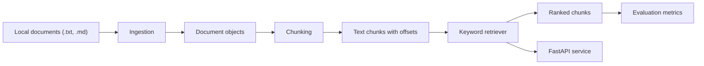

# Architecture

## Component Responsibilities

### Ingestion

Reads local `.txt` and `.md` files, derives stable document metadata, and rejects unsupported file extensions with clear errors.

### Chunking

Splits document text into overlapping character windows. Each chunk carries its source document, source path, text, and start/end offsets.

### Retrieval

Builds an in-memory keyword baseline over chunks. Queries are tokenized deterministically, scored by token overlap, and returned in ranked order.

### Evaluation

Provides simple retrieval metrics for small labeled examples: recall@k, precision@k, and mean reciprocal rank.

### API

Loads the configured local document folder at startup and serves retrieval through `POST /retrieve`. `GET /health` remains available even when no local documents are present.

### Configuration

Defaults live in `configs/default.yaml` and control the local document path, chunk size, chunk overlap, and default result count.
