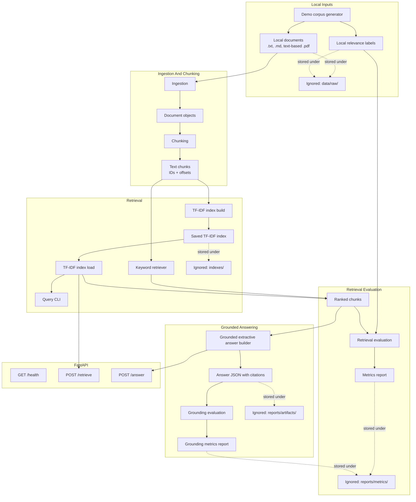

# Architecture

## Component Responsibilities

### Demo Corpus Generation

Creates tiny local demo documents and matching retrieval labels under ignored `data/raw/` paths. Existing files are preserved unless overwrite is requested.

### Ingestion

Reads local `.txt`, `.md`, and text-based `.pdf` files. It derives deterministic document IDs from file names, records source paths and metadata such as PDF page count, and raises clear errors for unsupported or unreadable files. Scanned-image PDFs and OCR are not supported.

### Chunking

Splits document text into overlapping chunks. Each chunk includes a stable chunk ID, document ID, source path, text, and character offsets.

### Retrieval

Provides a deterministic keyword baseline and a TF-IDF backend. The TF-IDF backend can build, save, load, and query a local index.

### Retrieval Evaluation

Reads local relevance labels, runs a selected retriever, and writes recall@k, precision@k, mean reciprocal rank, and per-query details to `reports/metrics/`.

### Grounded Answering

Builds extractive answers by selecting sentences from retrieved chunks. Responses include cited chunk IDs, cited document IDs, source previews, and a simple coverage score.

### Grounding Evaluation

Checks answer sentences against cited source text or previews. It reports sentence support, citation coverage, and unsupported sentences using deterministic local checks.

### API

`GET /health` reports service and index status. `POST /retrieve` returns ranked chunks. `POST /answer` returns an extractive answer with citations. The API loads the configured local TF-IDF index when available.
