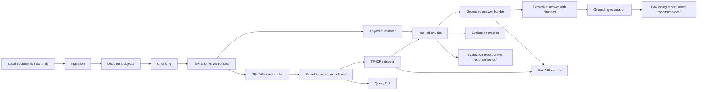

# Architecture

## Component Responsibilities

### Ingestion

Reads local `.txt` and `.md` files, derives stable document metadata, and rejects unsupported file extensions with clear errors.

### Chunking

Splits document text into overlapping character windows. Each chunk carries its source document, source path, text, and start/end offsets.

### Retrieval

Builds an in-memory keyword baseline over chunks. Queries are tokenized deterministically, scored by token overlap, and returned in ranked order.

### TF-IDF Vector Retrieval

Builds a local TF-IDF matrix from chunk text, saves it with the chunk metadata, and loads it for deterministic cosine-similarity retrieval.

### Evaluation

Provides simple retrieval metrics for small labeled examples: recall@k, precision@k, and mean reciprocal rank.

### Grounded Answering

Selects sentences from retrieved chunks using question-token overlap. Answers are extractive and include cited chunk IDs, cited document IDs, source previews, and a simple coverage score.

### Grounding Evaluation

Checks answer sentences against cited source text or previews, reports unsupported sentences, and computes deterministic citation coverage and sentence support metrics.

### Retrieval Evaluation Workflow

Reads local relevance labels, builds the selected retriever in memory, evaluates ranked results per query, and writes a JSON metrics report under `reports/metrics/`.

### API

Loads the configured saved TF-IDF index at startup and serves retrieval through `POST /retrieve` and extractive answering through `POST /answer`. `GET /health` remains available even when no saved index is present.

### Configuration

Defaults live in `configs/default.yaml` and control the local document path, chunk size, chunk overlap, default result count, retriever backend, and saved index path.
